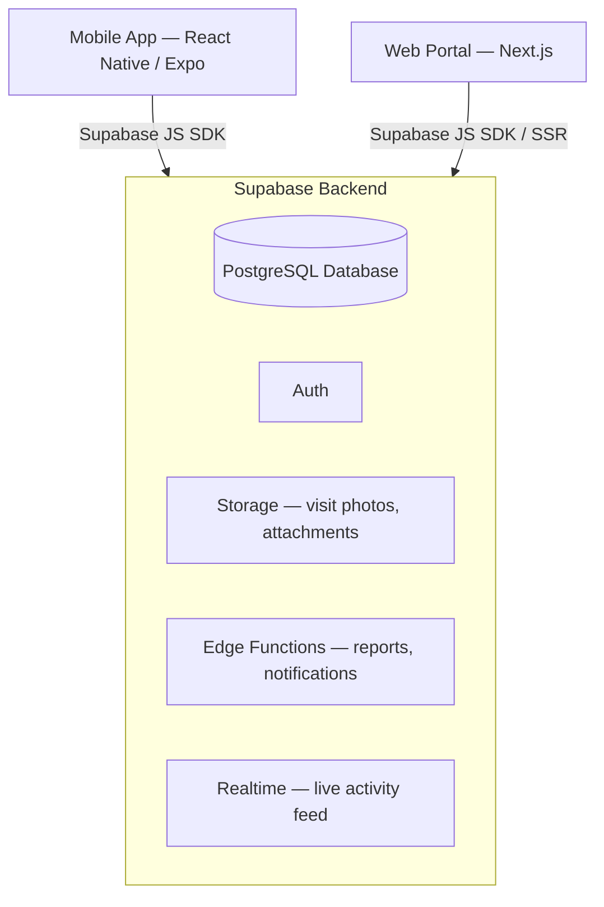
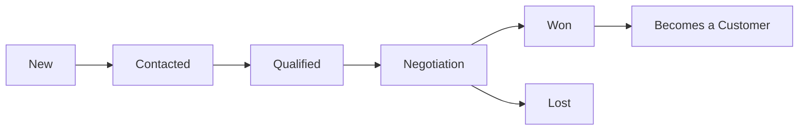

# CLC CRM System — Technical Specification

**Client:** CLC (Contracting Company — Saudi Arabia)
**Purpose:** Track leads and customers, log daily field activities (visits, emails, calls), and generate daily/periodic reports for management.

---

## 1. Scope Decisions & Assumptions

These are the calls made to turn the requirements into a concrete build. Flag anything you want changed before implementation starts.

| Decision | Choice | Why |
|---|---|---|
| Web frontend | **Next.js (React)** | You already run Next.js + Supabase on other platforms — no new stack to maintain |
| Mobile app | **React Native (Expo)** | Same reasoning — reuses React knowledge, one language across web + mobile |
| Backend | **Supabase** (Postgres + Auth + Storage + Edge Functions + Realtime) | As requested |
| Lead → Customer | A lead converts to a customer when its stage is set to `won` | Standard CRM pattern; the conversion just copies the record forward and keeps history |
| Daily reports | **Derived**, not manually written — the "report" is a query over that day's logged activities, per employee | Matches "log what I did → report what was done" instead of double data entry |
| Activity types | Visit, Email, Call, Meeting, Other | Covers "زيارات" and "إيميلات" plus the adjacent cases you'll hit in practice |
| Visit verification | GPS coordinates captured automatically when an employee logs a **Visit** from the mobile app | Gives Admin real proof of field visits, not just a text log |
| Geography | Leads, customers, and visits are tagged to a **Riyadh district** from a fixed 187-location reference list (bilingual EN/AR) | Riyadh is the primary operating area; a fixed list keeps addresses consistent and makes district-level reporting possible |

---

## 2. High-Level Architecture



- **Mobile app** — the field tool. Fast activity logging is the core job: open app, tap lead, log a visit/email/call, done in under 10 seconds.
- **Web portal** — the management tool. Admin dashboards, lead assignment, reporting, team oversight. Employees can also use it for a fuller view of their pipeline.
- **Supabase** is the single source of truth for both. No separate backend server needed — Postgres + RLS handles data access, Edge Functions handle anything that needs server-side logic (e.g., compiling a daily report PDF).

---

## 3. Lead Lifecycle



Leads and Customers are kept as **separate tables** (not one table with a type flag) because their fields diverge over time — a Customer accumulates project history, repeat business, and account-level data that a Lead never needs. The link back to the original lead is preserved for reporting (conversion rate, source effectiveness, etc.).

---

## 4. Database Schema (Supabase / PostgreSQL)

```sql
-- ============ ENUMS ============
create type user_role as enum ('admin', 'employee');
create type lead_status as enum ('new', 'contacted', 'qualified', 'negotiation', 'won', 'lost');
create type activity_type as enum ('visit', 'email', 'call', 'meeting', 'other');
create type related_entity as enum ('lead', 'customer');

-- ============ PROFILES (extends auth.users) ============
create table profiles (
  id uuid primary key references auth.users(id) on delete cascade,
  full_name text not null,
  email text not null,
  phone text,
  role user_role not null default 'employee',
  is_active boolean not null default true,
  created_at timestamptz not null default now()
);

-- ============ DISTRICTS (reference table) ============
create table districts (
  id serial primary key,
  city text not null default 'Riyadh',
  name_en text not null,
  name_ar text not null,
  latitude numeric not null,
  longitude numeric not null,
  unique (city, name_en)
);

create index idx_districts_city on districts(city);

-- ============ LEADS ============
create table leads (
  id uuid primary key default gen_random_uuid(),
  company_name text not null,
  contact_person text,
  phone text,
  email text,
  source text,                     -- referral, website, cold call, exhibition...
  status lead_status not null default 'new',
  estimated_value numeric,         -- estimated project/contract value
  project_type text,               -- e.g. residential, commercial, infrastructure
  district_id integer references districts(id),
  assigned_to uuid references profiles(id),
  notes text,
  created_at timestamptz not null default now(),
  updated_at timestamptz not null default now()
);

-- ============ CUSTOMERS ============
create table customers (
  id uuid primary key default gen_random_uuid(),
  company_name text not null,
  contact_person text,
  phone text,
  email text,
  address text,
  district_id integer references districts(id),
  converted_from_lead_id uuid references leads(id),
  assigned_to uuid references profiles(id),
  customer_since date not null default current_date,
  created_at timestamptz not null default now(),
  updated_at timestamptz not null default now()
);

-- ============ ACTIVITIES (the daily "حركات") ============
create table activities (
  id uuid primary key default gen_random_uuid(),
  employee_id uuid not null references profiles(id),
  related_entity_type related_entity not null,
  related_entity_id uuid not null,          -- lead_id or customer_id
  activity_type activity_type not null,
  description text,
  activity_date timestamptz not null default now(),
  latitude numeric,                          -- captured automatically for 'visit'
  longitude numeric,
  attachment_url text,                       -- Supabase Storage path (photo, email screenshot)
  follow_up_date date,
  outcome text,
  created_at timestamptz not null default now()
);

create index idx_activities_employee_date on activities(employee_id, activity_date);
create index idx_leads_assigned on leads(assigned_to);
create index idx_customers_assigned on customers(assigned_to);
create index idx_activities_entity on activities(related_entity_type, related_entity_id);
```

**Note on `related_entity_id`:** since it can point to either `leads` or `customers`, it isn't a plain foreign key. Enforce integrity with a trigger or check it at the application layer — happy to write the trigger version if you want stricter guarantees.

**Note on `districts`:** the table above is the shape; the actual 187-row seed (all Riyadh districts, universities, and industrial zones, bilingual EN/AR, with coordinates) ships as a separate ready-to-run file — `riyadh_districts_seed.sql` — so it doesn't bloat this document. That file also includes a `nearest_district(lat, lng)` SQL function: call it with the GPS coordinates captured on a **Visit** to auto-suggest which district the employee is standing in, instead of making them pick manually every time.

---

## 5. Roles & Permissions

| Capability | Admin | Employee |
|---|---|---|
| View all leads / customers | ✅ | Own assignments only |
| Create / assign leads | ✅ | Can create; can't assign to others |
| Update lead status | ✅ (any) | ✅ (own only) |
| Log activities | ✅ | ✅ (own only) |
| View reports | ✅ (everyone's) | ✅ (own only) |
| Manage employees & roles | ✅ | ❌ |
| Export data | ✅ | Own data only |

### Example RLS Policies

```sql
alter table leads enable row level security;
alter table customers enable row level security;
alter table activities enable row level security;

-- Leads: employees see their own, admins see all
create policy "leads_select" on leads
  for select using (
    assigned_to = auth.uid()
    or exists (select 1 from profiles where id = auth.uid() and role = 'admin')
  );

create policy "leads_update" on leads
  for update using (
    assigned_to = auth.uid()
    or exists (select 1 from profiles where id = auth.uid() and role = 'admin')
  );

-- Activities: an employee only ever logs against themselves
create policy "activities_insert" on activities
  for insert with check (employee_id = auth.uid());

create policy "activities_select" on activities
  for select using (
    employee_id = auth.uid()
    or exists (select 1 from profiles where id = auth.uid() and role = 'admin')
  );
```

(Same pattern repeats for `customers`.)

`districts` is reference data, not user data — every authenticated user can read it, nobody edits it from the app:

```sql
alter table districts enable row level security;

create policy "districts_select_all" on districts
  for select using (auth.role() = 'authenticated');
```


---

## 6. Web Portal — Screens

1. **Login**
2. **Dashboard** — Admin sees company-wide KPIs (open leads, conversion rate, activities logged today, top performers); Employee sees their own pipeline snapshot
3. **Leads** — list view + Kanban pipeline view (drag between stages) + detail page with full activity history
4. **Customers** — list + detail page
5. **Activity Timeline** — chronological feed, filterable by employee/date/type
6. **Reports** — daily / weekly / monthly, filterable by employee, exportable (PDF/Excel)
7. **Team Management** (Admin only) — add/remove employees, reassign leads
8. **Settings**

## 7. Mobile App — Screens

Built for speed in the field — this is the app an employee opens standing outside a client's office right after a visit.

1. **Login**
2. **Home** — today's follow-ups + quick-log button
3. **My Leads / My Customers** — simple list, tap to open
4. **Quick Log** — one screen: pick type (Visit/Email/Call/Meeting), pick the lead/customer, add a note. Visit auto-attaches GPS; Email/Call skip that step.
5. **Lead/Customer Detail** — contact info + full activity history
6. **My Daily Report** — today's logged activities, read-only summary

---

## 8. Reporting Logic

No separate "reports" table needed for v1 — a report is just a query:

```sql
-- "What did employee X do today?"
select a.*, 
       coalesce(l.company_name, c.company_name) as entity_name
from activities a
left join leads l on a.related_entity_type = 'lead' and a.related_entity_id = l.id
left join customers c on a.related_entity_type = 'customer' and a.related_entity_id = c.id
where a.employee_id = :employee_id
  and a.activity_date::date = current_date
order by a.activity_date;
```

Wrap the weekly/monthly versions the same way with a date range. An Edge Function can compile this into a formatted PDF/Excel export on demand rather than storing pre-generated reports.

---

## 9. Suggested Build Order

1. **Schema + Auth + RLS** — get the data model and permission boundaries solid first; everything else depends on this being right
2. **Web Portal core** — Leads/Customers CRUD, employee management
3. **Mobile app core** — login, quick-log flow (this is the feature employees will use most, so it deserves the most polish)
4. **Reporting & dashboards**
5. **Notifications** — follow-up reminders, push notifications for overdue leads

---

## 10. Recommended Enhancements (V2 Upgrades)

None of this blocks the v1 build — everything below layers on top of the schema in Section 4 without changing it. Ordered by relevance to a Saudi contracting company specifically.

### High-impact for this business

| Enhancement | Why it matters here |
|---|---|
| **WhatsApp Business API integration** | In Saudi/Gulf B2B, WhatsApp usually beats email as the primary channel. Two uses: let employees log a "WhatsApp" activity as easily as email, and auto-send the daily/weekly report digest to Admin over WhatsApp instead of requiring a portal login |
| **Offline-first mobile sync** | Site visits happen at locations with weak or no signal. Quick Log should write to local storage first and sync to Supabase when back online — otherwise a visit logged in a dead zone is just lost |
| **Arabic UI (i18n)** | This spec is in English because that's your working language for specs — but the shipped app should have an Arabic/English toggle. Most field employees will run it in Arabic day-to-day |
| **Lead SLA & auto-escalation** | Flag any lead with no activity in N days (configurable) and surface it on the Admin dashboard. Leads silently going cold is the most common CRM failure mode |
| **Quote/proposal attachments** | Contracting deals close on a formal quote. Letting a lead/customer hold attached documents (Supabase Storage) turns the CRM into the actual deal record, not just an activity log |

### Smaller, still worth it

- Duplicate-lead detection on phone/email when adding a new lead
- Audit log (who changed what, when) for accountability
- Business-card photo → auto-filled lead (OCR) for leads met in person
- Source ROI + conversion-funnel analytics — which lead sources actually convert
- Two-factor auth for Admin accounts, given they hold full company data

---

## 11. Next Steps

Pick whichever's most useful to start with:

- Ready-to-run **SQL migration file** (schema + RLS, as a single script)
- **Next.js project scaffold** (folder structure, Supabase client setup, auth flow)
- **React Native/Expo scaffold** (same, for mobile)
- Split this spec into **separate module files** (one per feature) — matches how you typically hand work to Codex/Claude Code/Antigravity
